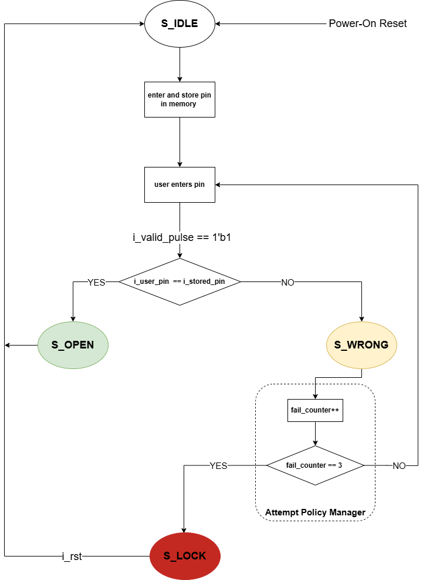
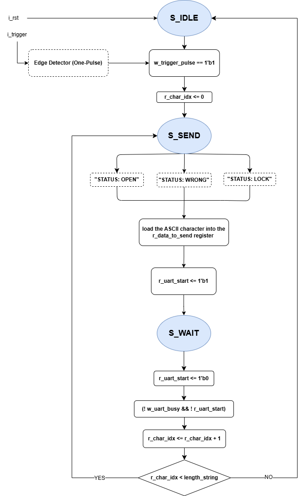

# Real-Time Alarm System with UART Web Monitoring
# Technical Description
Verilog implementation of a modular System-on-Chip (SoC) security controller designed for the Basys3 FPGA board. This project features a robust PIN verification engine, a hardware-enforced lockout policy and a custom UART-based communication protocol that broadcasts system status to a real-time Python/Streamlit dashboard.

# Architecture
The architecture is based on a strictly modular RTL approach, ensuring deterministic behavior and timing-clean implementation.  
It integrates high-frequency debouncers, edge-sensitive pulse generators, and a dual-FSM system: one for security logic and one for asynchronous data serialization.  
The system bridges the gap between the 100MHz FPGA clock domain and a 9600 Baud serial interface for external monitoring.  

# Objectives
The primary objective was to design a production-ready FPGA security system capable of:  
* **Validating user-entered PINs against a secure hardware register with single-cycle comparison logic.**    
* **Implementing a deterministic Finite State Machine (FSM) with a 3-attempt lockout policy (SYSTEM_LOCK).**    
* **Real-time asynchronous status broadcasting via a custom ASCII-over-UART protocol.**    
* **Eliminating data race conditions and button bouncing through advanced input conditioning (Edge Detection & Debouncing).**    
* **Providing a responsive Web-based monitoring UI using Python and Streamlit for live security logs.**  

# FSM Logic
The system's "intelligence" is split into two specialized controllers to ensure reliability:
## 1. Security Controller FSM
Manages the access states (IDLE, OPEN, WRONG, LOCK) and the attempt counter. 
 

  

## 2. UART Transmission FSM
* Serializes the system status into full ASCII strings (e.g., "STATUS:OPEN;") using a hardware handshaking protocol (w_uart_busy). 

  

# Skills
This project demonstrates proficiency in:  
**→ RTL Design and modular Verilog architecture for Artix-7 FPGAs.**      
**→ Advanced FSM design for both control logic and data serialization.**  
**→ Cross-domain synchronization (FPGA-to-PC communication).**  
**→ Input conditioning and edge-sensitive event handling in high-frequency designs.**  
**→ Hardware-Software integration (Verilog + Python/Streamlit).**  
**→ Verification and Validation (V&V) using RTL simulation and hardware testbenches.**  

# Testing 
The design was fully synthesized and validated on the `Basys3 board`.  
Testing confirmed `stable debouncing`, zero-error `UART transmission` (no data flooding due to implemented edge detectors), and `real-time synchronization` with the Python-based dashboard.  
Timing reports confirmed a positive Slack at 100MHz.  

# Key Technologies
`Verilog HDL`, `Artix-7 (Basys3)`, `Xilinx Vivado`, `UART Protocol`, `RTL Design`, `Python`, `Streamlit UI`, `Digital Logic Synthesis.`
